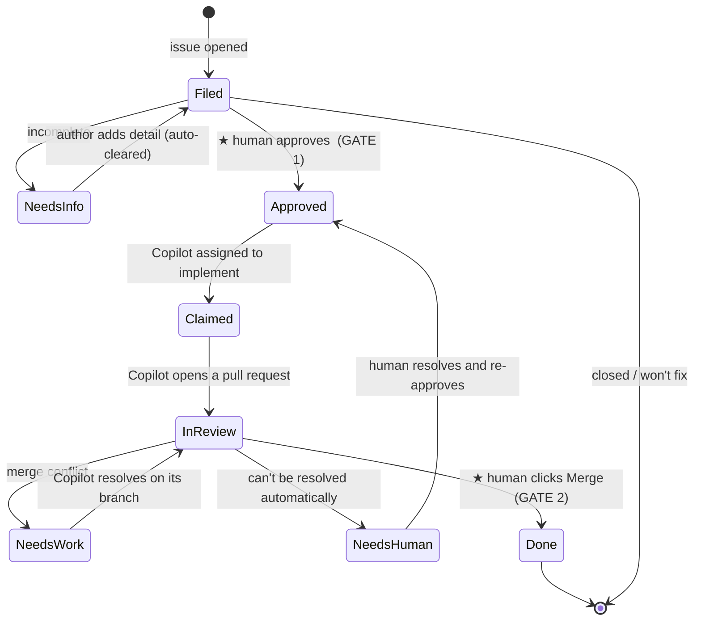

# Puppets

**Puppets is a fully server-side automation harness that turns GitHub issues into merged
changes — end to end, across an entire fleet of repositories — with a human at the two
decisions that matter.**

The whole system runs in the cloud. A single central controller reaches into every
repository it manages, reads each issue's **labels as state**, and drives it through its
lifecycle: triage → approval → implementation → review → merge. **GitHub's Copilot coding
agent does the writing** — it's assigned to approved issues and opens real pull requests —
while GitHub Actions provides the compute. There's nothing to install per repository and no
local process to babysit; a repo joins simply by being added to the controller's list.

**Issue labels are the interface.** Instead of a bespoke database or UI, Puppets encodes the
entire workflow in a small set of `puppets:*` labels. Moving an issue forward — or holding it
back — is just a label change, which means the whole pipeline is legible, auditable, and
controllable straight from the GitHub issue view you already use.

**A human owns the two gates.** Filed issues are untrusted input, so nothing is worked on
until a maintainer *approves* it, and nothing ever merges until a person clicks **Merge**.
Everything in between is automated; those two decisions never are.

## Why it exists

The starting point was a fire-and-forget script that assigned an AI agent to issues in one
shot — no plan, no human gate, no pull-request loop, one repo at a time. Puppets replaces
that with a **stateful, reviewable lifecycle that scales across many repositories at once**:

- **One central, server-side controller** manages every configured repository from a single
  place — no per-repo setup, no per-repo footprint.
- **AI compute runs in the cloud** — the Copilot coding agent opens real pull requests.
- **Labels carry the state**, so every step is visible and self-healing: re-running the
  controller simply re-derives where each issue is and continues.
- **A human stays at the two gates.** No agent touches an item until it is *approved*, and
  nothing merges until a person clicks **Merge**.
- **Every filed item is treated as untrusted input.** Issue text is data, never
  instructions — it can't tell the automation what to do.

## How it works

A single scheduled reconciler watches the configured repositories. On each pass it reads the
current state of every issue and pull request (from its labels) and nudges it one step
further. Because the state lives in labels, re-running the reconciler is always safe — it
simply re-derives where each item is and picks up where it left off.

### The two human gates

1. **Approval to work it** (`puppets:approved`). A filed item is untrusted; nothing acts on
   it until a trusted maintainer approves it. The automation re-verifies that the person who
   approved actually has write/triage access before proceeding — the approval gate is the
   heart of the security model.
2. **Approval to merge it.** A person always clicks **Merge**. There is no auto-merge and no
   automated approval, ever.

### The lifecycle

### What each stage does

| Stage | What happens |
|---|---|
| **Triage** | When an issue is filed, a lightweight, non-AI check looks for the essentials (a description, steps to reproduce, version, logs). If something's missing, the item is labelled *needs info* with a friendly comment. As soon as the author supplies enough detail, that label clears itself. |
| **Approval — Gate 1** | A maintainer approves the item. The automation confirms the approver is allowed to, then proceeds. |
| **Implementation** | The Copilot coding agent is assigned and given any repository-specific guidance, then writes the change and opens a pull request. |
| **In review** | The pull request is tracked to completion. A ready pull request whose checks are green is automatically taken out of draft so it surfaces for the human. If its branch falls behind the base branch, it's brought up to date; if it develops a conflict, the agent loops on its own branch to resolve it, escalating to a human only if it can't. |
| **Merge — Gate 2** | A person clicks **Merge**. The item is marked *done* and the issue closes. |

## Labels

State is carried by a small set of `puppets:*` labels — one active at a time. Maintainers
only ever apply two by hand; the automation manages the rest.

| Label | Meaning |
|---|---|
| `puppets:needs-info` | Missing details; the author needs to add them (clears automatically once enough detail is present). |
| `puppets:approved` | **Gate 1.** Approved to be worked on. *Applied by a maintainer.* |
| `puppets:claimed` | Picked up; the coding agent is assigned and implementing. |
| `puppets:in-review` | A pull request is open and being tracked; awaiting the human's Merge click. |
| `puppets:needs-work` | The pull request hit a conflict; the agent is resolving it. |
| `puppets:needs-human` | A genuine human decision is needed. *Can be applied by a maintainer to push an item back.* |
| `puppets:done` | The pull request merged and the issue closed. |
| `puppets:no-auto` | Hard opt-out; Puppets leaves the item alone entirely. |

The only two a maintainer adds by hand: **`puppets:approved`** (go) and
**`puppets:needs-human`** (stop / push back). Everything else is managed automatically.

## Staying informed

Puppets never spams. Instead, it posts a periodic digest that surfaces exactly what needs a
human:

- **New issues to review** — items filed since the last run that haven't been approved or
  dismissed yet, so nothing slips through unseen.
- **Waiting on you** — items parked on a human decision (`puppets:needs-human`) or a
  pull request sitting ready for the Merge click.

## Security posture

- **Untrusted input everywhere.** An issue's title and body are treated as data, never as
  commands the automation should follow.
- **Approval is verified.** Applying the approval label isn't enough on its own — the
  automation checks that the approver genuinely has the access to do so.
- **No automatic merges.** No job is ever granted the ability to merge; a human action is
  the only path to *done*.
- **Opt-out is absolute.** `puppets:no-auto` takes an item completely out of scope.

