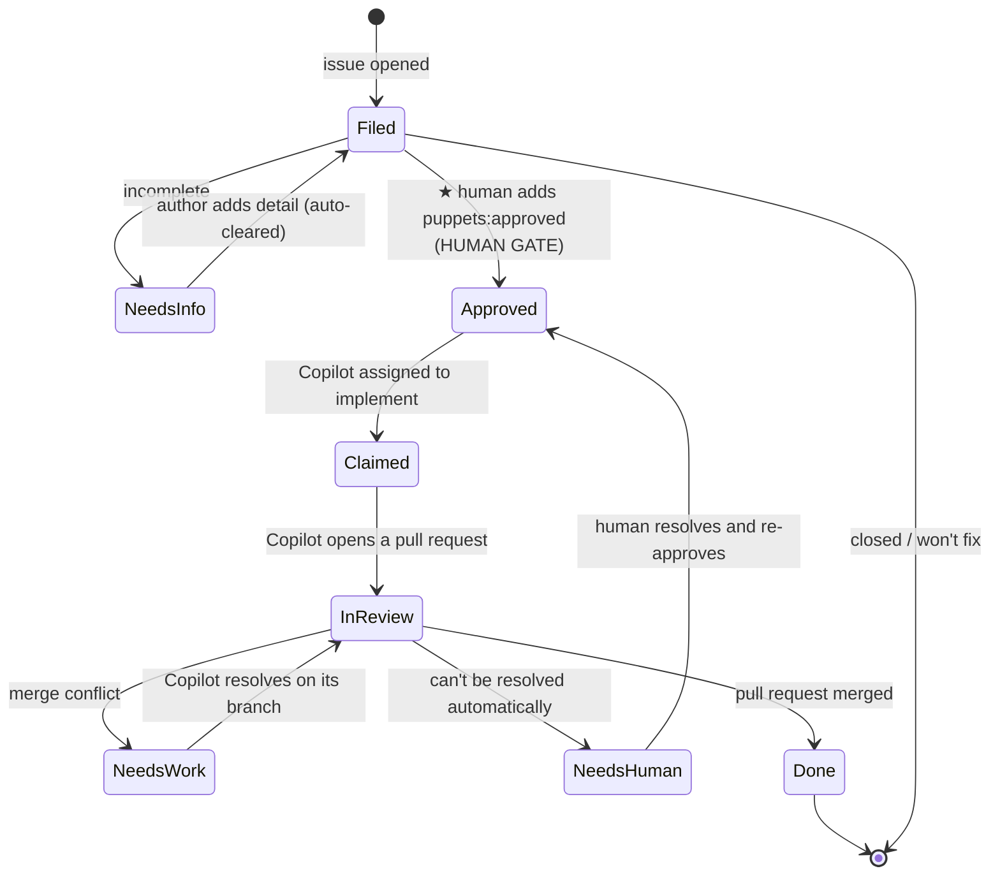

**Puppets is a fully server-side automation harness that turns GitHub issues into merged
changes — end to end, across an entire troupe of repositories — with human approval before
work begins.**

The whole system runs in the cloud. A single central controller reaches into every
repository it manages, reads each issue's **labels as state**, and drives it through its
lifecycle: triage → approval → implementation → review → merge. **GitHub's Copilot coding
agent does the writing** — it's assigned to approved issues and opens real pull requests —
while GitHub Actions provides the compute. There's no per-repository workflow to install and
no local process to babysit; a repo joins by being added to the controller's list (and having
the Copilot coding agent enabled).

**Issue labels are the interface.** Instead of a bespoke database or UI, Puppets encodes the
entire workflow in a small set of `puppets:*` labels. Moving an issue forward — or holding it
back — is just a label change, which means the whole pipeline is legible, auditable, and
controllable straight from the GitHub issue view you already use.

**A human owns the approval gate.** Filed issues are untrusted input, so nothing is worked
on until a maintainer applies `puppets:approved`. Everything after that approval can be
driven by automation.

## Why it exists

The starting point was a fire-and-forget script that assigned an AI agent to issues in one
shot — no plan, no human gate, no pull-request loop, one repo at a time. Puppets replaces
that with a **stateful, reviewable lifecycle that scales across many repositories at once**:

> **Related work in progress:** Puppets is related to Jeff's
> [OpenClaw Engineering Harness](https://octo.steinbok.net/harness.html), which is developing
> a similar label-driven improvement loop inside Octo. The projects share a human approval
> gate and GitHub Issues as workflow state, while Puppets focuses on centrally managing a
> troupe of repositories.

- **One central, server-side controller** manages every configured repository from a single
  place — no per-repo workflow and no reconciler logic to maintain in each repo.
- **AI compute runs in the cloud** — the Copilot coding agent opens real pull requests.
- **Labels carry the state**, so every step is visible and self-healing: re-running the
  controller simply re-derives where each issue is and continues.
- **A human controls the approval gate.** No agent touches an item until it is *approved*.
- **Every filed item is treated as untrusted input.** Issue text is data, never
  instructions — it can't tell the automation what to do.

## How it works

A single scheduled reconciler watches the configured repositories. On each pass it reads the
current state of every issue and pull request (from its labels) and nudges it one step
further. Because the state lives in labels, re-running the reconciler is always safe — it
simply re-derives where each item is and picks up where it left off.

### The human gate

**Approval to work it** (`puppets:approved`). A filed item is untrusted; nothing acts on it
until a trusted maintainer approves it. The automation re-verifies that the person who
approved actually has write/triage access before proceeding — the approval gate is the
heart of the security model.

### The lifecycle



## Stages &amp; labels

State is carried by a small set of `puppets:*` labels — one active at a time. Each label
*is* a lifecycle stage, so re-running the reconciler is always safe: it re-derives where
each item is from its label and picks up where it left off. Maintainers only ever apply two
by hand; the automation manages the rest.

| Stage | Label | What happens | Applied by |
|---|---|---|---|
| Triage | `puppets:needs-info` | A lightweight, non-AI check looks for the essentials (description, steps to reproduce, version, logs). If something's missing, the item is labelled with a friendly comment; the label clears itself once the author supplies enough detail. | Automatic |
| **Approval — human gate** | `puppets:approved` | A maintainer approves the item; the automation re-verifies the approver actually has write/triage access before anything proceeds. This gate is the heart of the security model. | **Maintainer** |
| Implementation | `puppets:claimed` | The Copilot coding agent is assigned, given any repository-specific guidance, writes the change, and opens a pull request. | Automatic |
| In review | `puppets:in-review` | The pull request is tracked to completion — taken out of draft once its checks are green, and kept up to date when its branch falls behind the base. | Automatic |
| In review (conflict) | `puppets:needs-work` | The pull request hit a merge conflict; the agent loops on its own branch to resolve it. | Automatic |
| Escalation | `puppets:needs-human` | A genuine human decision is needed (e.g. a conflict the agent can't resolve). | Automatic — or a **maintainer** to push an item back |
| Completion | `puppets:done` | The pull request merged under the configured merge policy; the item is marked done and the issue closes. | Automatic |
| Opt-out | `puppets:no-auto` | Hard opt-out; Puppets leaves the item alone entirely. | Maintainer |

The only two a maintainer adds by hand: **`puppets:approved`** (go) and
**`puppets:needs-human`** (stop / push back). Everything else is managed automatically.

## Repository setup

Puppets is **centrally driven**: the reconciler, credentials, and all lifecycle logic live
in the controller repository. Managed repositories install **no Puppets workflow**.

To add a managed repository:

- The **Copilot coding agent enabled** on the repo, so the reconciler can assign it (it
  refuses to proceed on a repo where Copilot isn't assignable).
- Add the repository to the controller's `repositories:` list.
- Optionally, a **`.github/puppets/` guidance directory** with step-specific Markdown files
  for the agent (see [below](#per-repo-guidance-optional)).

The current reconciler consumes `.github/puppets/implementation.md`; the directory layout
allows later lifecycle steps to gain their own guidance without changing the repository
contract. GitHub Copilot's native instruction files are separate from Puppets configuration.

Everything else — triage, state, labels, and the digest — is driven centrally.

### Per-repo guidance (optional)
{: #per-repo-guidance-optional}

Managed repos can carry per-step guidance for the coding agent under a
`.github/puppets/` directory — one Markdown file per lifecycle step
(`.github/puppets/<step>.md`, read from the default branch). **Today the reconciler consumes
one of them, `.github/puppets/implementation.md`:** whenever the coding agent is assigned an
approved issue in that repo, the file's contents are posted as a trusted
**implementation-instructions** comment for the agent to follow. Use it for repo-specific
conventions: how to run tests, coding standards, files to avoid, PR expectations. It's
entirely optional (a repo with no such file is handled normally), but note the guardrails on
a guidance file: it's read from the **default branch**, must be **≤ 20 KB**, and if it's
present-but-malformed the reconciler **skips that repo** rather than guessing.

```markdown
<!-- .github/puppets/implementation.md -->
# Implementation guidance for the Copilot coding agent

- Run the full test suite with `npm test` before opening a PR; keep it green.
- Match the existing code style; do not add new dependencies without a clear need.
- Never touch `src/generated/**` — it is produced by codegen.
- Keep PRs focused on the linked issue; describe the change and how you verified it.
```

### That's the whole repository setup

- **Managed repos:** enable the Copilot coding agent, and *optionally* add a
  `.github/puppets/` guidance directory. Onboard by adding a line to the controller's
  `repositories:` list; the label set is bootstrapped for you — there's no workflow to
  install.

## Run your own controller

Puppets can be copied into a controller repository without creating or depending on a
separate Puppets project.

[**Explore the complete canonical example with syntax highlighting →**](explorer.html)

Download the three workflow files into `.github/workflows/`:

1. [**Download the canonical `puppets-controller.yml` example**](downloads/puppets-controller.yml)
   — your schedule and troupe configuration.
2. [`puppets-reconcile.yml`](downloads/puppets-reconcile.yml) — the reusable lifecycle
   engine.
3. [`puppets-bootstrap-labels.yml`](downloads/puppets-bootstrap-labels.yml) — the label
   bootstrapper used by the engine.

Then download [`puppets-reconcile.js`](downloads/puppets-reconcile.js) into
`.github/scripts/`. The workflow files contain only configuration and orchestration; the
reconciliation implementation lives in this JavaScript module.

Edit `puppets-controller.yml` with your GitHub owner, repository names, and the logins
allowed to apply `puppets:approved`. Then create a `PUPPETS_TOKEN` Actions secret in the
controller repository. Keep the controller filename as `puppets-controller.yml`, or update
its `inbox_workflow_id` input to match the filename you choose.

Use a fine-grained personal access token that can access the controller and every managed
repository. It needs:

- **Actions: read** on the controller repository, to determine the previous reconciliation
  run for inbox notifications.
- **Contents: read** on managed repositories, to read the default branch and optional
  `.github/puppets/implementation.md`.
- **Issues: read and write** on managed repositories, to inspect, label, comment, and assign
  issues.
- **Pull requests: read and write** on managed repositories, to track pull requests, update
  branches, and move completed drafts to ready-for-review.

Enable the Copilot coding agent in each managed repository, commit the four files, and run
**Puppets Lifecycle** manually with `dry_run` enabled before relying on the schedule.
Notifications are intentionally deployment-specific: the reusable engine exposes
`waiting_count` and `waiting_message` outputs so the controller can send them through any
notifier.

## Staying informed

Puppets never spams. Instead, it posts a periodic digest that surfaces exactly what needs a
human:

- **New issues to review** — items filed since the last run that haven't been approved or
  dismissed yet, so nothing slips through unseen.
- **Waiting on you** — items parked on a human decision (`puppets:needs-human`).

## Security posture

- **Untrusted input everywhere.** An issue's title and body are treated as data, never as
  commands the automation should follow.
- **Approval is verified.** Applying the approval label isn't enough on its own — the
  automation checks that the approver genuinely has the access to do so.
- **Opt-out is absolute.** `puppets:no-auto` takes an item completely out of scope.
