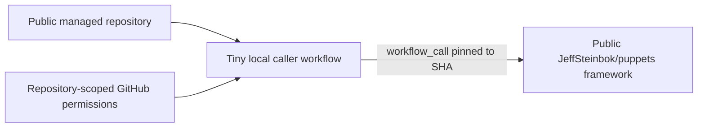
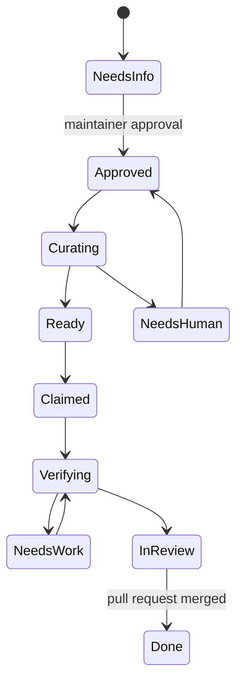

# Puppets

> **Migration status:** The public framework now lives at
> [`JeffSteinbok/puppets`](https://github.com/JeffSteinbok/puppets), with documentation at
> [jeffsteinbok.github.io/puppets](https://jeffsteinbok.github.io/puppets/).
> `obsidian-onedrive` is the first live caller. The source downloads and explorer on this
> legacy site describe the old central controller and are not the installation model for
> new repositories.

Puppets turns an approved GitHub issue into a reviewed pull request. Each managed repository
owns a very small workflow that calls a versioned reusable workflow from the shared public
framework.



## Design principles

- **Caller initiated:** the managed repository runs Puppets; no outside controller reaches
  into it.
- **Cheap for public repositories:** standard hosted-runner usage is attributed to the
  public caller and is free.
- **Shared implementation:** runtime code, default lifecycle data, prompts, schemas, and
  tests live in one public framework repository.
- **Locally overridable:** trusted default-branch files under `.github/puppets/` may replace
  documented settings and prompts or overlay lifecycle data.
- **Data-driven:** labels, state metadata, transitions, limits, prompts, and feature policy
  are data rather than hard-coded control flow.
- **Fail closed:** approval provenance, permission checks, `puppets:no-auto`, trusted-branch
  loading, and secret isolation are procedural invariants that local data cannot weaken.

## Repository footprint

A managed repository contains:

```text
.github/workflows/puppets.yml
.github/puppets/                 optional
  config.json
  lifecycle.json
  prompts/
```

The workflow owns triggers, explicit permissions, concurrency, and a pinned call to the
public framework. It contains no lifecycle implementation.

## Lifecycle



The human approval label is the trust gate. No model or coding agent acts before Puppets
verifies who applied it and confirms that person's current repository permission.

The issue is authoritative. Labels mirrored onto a pull request are visibility projections
and cannot advance the issue.

## Overrides

The framework supplies the defaults. A repository may override documented values using
files read only from its default branch:

- `config.json` for supported scalar settings;
- `prompts/*.md` to replace a default step prompt; and
- `lifecycle.json` as a validated keyed overlay on the default lifecycle.

Invalid or unknown configuration fails before mutation. Overrides cannot disable approval
verification, opt-out handling, trusted-branch loading, transition validation, or other
security invariants.

## Cost model

- Use one staggered daily schedule per repository initially.
- Process one new issue and at most two in-flight issues per run by default.
- Perform deterministic filtering before model requests.
- Never spend model tokens before human approval.
- Keep event triggers optional until their extra workflow volume is justified.
- Use GitHub-native `needs-human` views or one batched digest instead of private
  notification runs for every transition.

Copilot and model requests remain separately metered; moving the workflow does not make
those requests free.

## Build status

The canonical architecture and migration plan live in
[`docs/puppets-lifecycle.md`](../../puppets-lifecycle.md). Implementation is tracked in
[automation issue #18](https://github.com/JeffSteinbok/automation/issues/18), with
approval-gate regression coverage tracked in
[issue #16](https://github.com/JeffSteinbok/automation/issues/16).

The legacy private controller stays active only until the first public caller has been
verified. It will then be disabled before additional live callers are enabled, preventing
two controllers from acting on the same issue.

The public `JeffSteinbok/puppets` repository publishes the Puppets documentation through
GitHub Pages. A custom domain and `CNAME` will be added later after Jeff completes the DNS
configuration.
