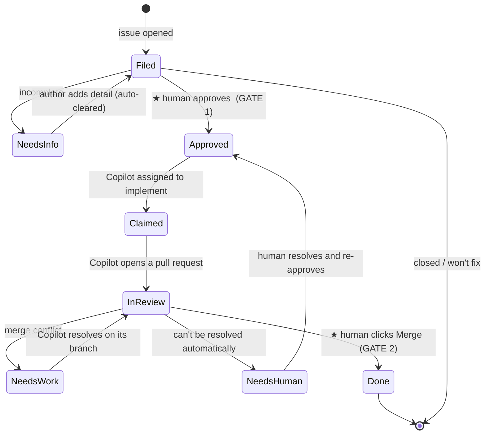

**Puppets is a fully server-side automation harness that turns GitHub issues into merged
changes — end to end, across an entire fleet of repositories — with a human at the two
decisions that matter.**

The whole system runs in the cloud. A single central controller reaches into every
repository it manages, reads each issue's **labels as state**, and drives it through its
lifecycle: triage → approval → implementation → review → merge. **GitHub's Copilot coding
agent does the writing** — it's assigned to approved issues and opens real pull requests —
while GitHub Actions provides the compute. There's no per-repository workflow to install and
no local process to babysit; a repo joins by being added to the controller's list (and having
the Copilot coding agent enabled).

**Issue labels are the interface.** Instead of a bespoke database or UI, Puppets encodes the
entire workflow in a small set of `puppets:*` labels. Moving an issue forward — or holding it
back — is just a label change, which means the whole pipeline is legible, auditable, and
controllable straight from the GitHub issue view you already use.

**A human owns the two gates.** Filed issues are untrusted input, so nothing is worked on
until a maintainer *approves* it, and nothing ever merges until a person clicks **Merge**.
Everything in between is automated; those two decisions never are.

## Why it exists

The starting point was a fire-and-forget script that assigned an AI agent to issues in one
shot — no plan, no human gate, no pull-request loop, one repo at a time. Puppets replaces
that with a **stateful, reviewable lifecycle that scales across many repositories at once**:

- **One central, server-side controller** manages every configured repository from a single
  place — no per-repo workflow and no reconciler logic to maintain in each repo.
- **AI compute runs in the cloud** — the Copilot coding agent opens real pull requests.
- **Labels carry the state**, so every step is visible and self-healing: re-running the
  controller simply re-derives where each issue is and continues.
- **A human stays at the two gates.** No agent touches an item until it is *approved*, and
  nothing merges until a person clicks **Merge**.
- **Every filed item is treated as untrusted input.** Issue text is data, never
  instructions — it can't tell the automation what to do.

## How it works

A single scheduled reconciler watches the configured repositories. On each pass it reads the
current state of every issue and pull request (from its labels) and nudges it one step
further. Because the state lives in labels, re-running the reconciler is always safe — it
simply re-derives where each item is and picks up where it left off.

### The two human gates

1. **Approval to work it** (`puppets:approved`). A filed item is untrusted; nothing acts on
   it until a trusted maintainer approves it. The automation re-verifies that the person who
   approved actually has write/triage access before proceeding — the approval gate is the
   heart of the security model.
2. **Approval to merge it.** A person always clicks **Merge**. There is no auto-merge and no
   automated approval, ever.

### The lifecycle



### What each stage does

| Stage | What happens |
|---|---|
| **Triage** | When an issue is filed, a lightweight, non-AI check looks for the essentials (a description, steps to reproduce, version, logs). If something's missing, the item is labelled *needs info* with a friendly comment. As soon as the author supplies enough detail, that label clears itself. |
| **Approval — Gate 1** | A maintainer approves the item. The automation confirms the approver is allowed to, then proceeds. |
| **Implementation** | The Copilot coding agent is assigned and given any repository-specific guidance, then writes the change and opens a pull request. |
| **In review** | The pull request is tracked to completion. A ready pull request whose checks are green is automatically taken out of draft so it surfaces for the human. If its branch falls behind the base branch, it's brought up to date; if it develops a conflict, the agent loops on its own branch to resolve it, escalating to a human only if it can't. |
| **Merge — Gate 2** | A person clicks **Merge**. The item is marked *done* and the issue closes. |

## Labels

State is carried by a small set of `puppets:*` labels — one active at a time. Maintainers
only ever apply two by hand; the automation manages the rest.

| Label | Meaning |
|---|---|
| `puppets:needs-info` | Missing details; the author needs to add them (clears automatically once enough detail is present). |
| `puppets:approved` | **Gate 1.** Approved to be worked on. *Applied by a maintainer.* |
| `puppets:claimed` | Picked up; the coding agent is assigned and implementing. |
| `puppets:in-review` | A pull request is open and being tracked; awaiting the human's Merge click. |
| `puppets:needs-work` | The pull request hit a conflict; the agent is resolving it. |
| `puppets:needs-human` | A genuine human decision is needed. *Can be applied by a maintainer to push an item back.* |
| `puppets:done` | The pull request merged and the issue closed. |
| `puppets:no-auto` | Hard opt-out; Puppets leaves the item alone entirely. |

The only two a maintainer adds by hand: **`puppets:approved`** (go) and
**`puppets:needs-human`** (stop / push back). Everything else is managed automatically.

## Build your own

Puppets is **centrally driven**: the reconciler and all of its logic live in one
**controller repository** that you own (private is fine), and the repositories it manages
need **no workflow of their own**. Standing up an instance means adding two workflow files
and one token to the controller repo.

Managed repos aren't *completely* untouched, though — each one needs two things:

- The **Copilot coding agent enabled** on the repo, so the reconciler can assign it (it
  refuses to proceed on a repo where Copilot isn't assignable).
- Optionally, a small **`.github/puppets/implementation.md`** file that gives the agent
  repo-specific guidance (see [below](#per-repo-guidance-optional)).

Everything else — triage, state, labels, the digest — is driven centrally.

### 1. The fleet list

Every managed repository is named in a `REPOS` block. This is the only thing you edit to add
or remove a repo from the pipeline. Keep it identical in both workflows below.

```yaml
env:
  # One repo per line (owner is set in the script). Add a repo here — that's all
  # it takes to bring it under management. No files are added to the repo itself.
  REPOS: |
    your-repo-a
    your-repo-b
```

### 2. `.github/workflows/puppets-lifecycle.yml`

The central reconciler. It runs on a schedule (or on demand), reads each issue's `puppets:*`
label to determine its state, performs deterministic triage, verifies the approval gate, and
only then assigns the Copilot coding agent. Re-running it is always safe — it re-derives
state from labels and continues.

```yaml
name: Puppets Lifecycle

on:
  schedule:
    - cron: "0 8 * * *"        # daily
  workflow_dispatch:
    inputs:
      dry_run:
        description: "Report transitions without changing issues"
        type: boolean
        default: false
      max_issues_per_repo:
        description: "Max approved issues to assign per repo per run"
        type: string
        default: "1"

permissions:
  contents: read

env:
  REPOS: |
    your-repo-a
    your-repo-b

jobs:
  # Ensure the shared puppets:* label vocabulary exists in every managed repo.
  bootstrap-labels:
    uses: ./.github/workflows/puppets-bootstrap-labels.yml
    with:
      dry_run: ${{ inputs.dry_run || false }}
    secrets: inherit

  reconcile:
    needs: bootstrap-labels
    runs-on: ubuntu-latest
    steps:
      - name: Reconcile issue lifecycle
        uses: actions/github-script@v9
        env:
          DRY_RUN: ${{ inputs.dry_run }}
          MAX_ISSUES_PER_REPO: ${{ inputs.max_issues_per_repo || '1' }}
        with:
          # Fine-grained PAT with cross-repo access (see "The token" below).
          github-token: ${{ secrets.PUPPETS_PAT }}
          script: |
            const owner = "your-github-username";
            const repos = `${process.env.REPOS || ""}`
              .trim().split("\n").map((r) => r.trim()).filter(Boolean);
            // For each repo: read issues, derive state from puppets:* labels,
            // triage new items, verify Gate 1 (puppets:approved was applied by a
            // user with write/triage access), then assign the Copilot coding agent
            // to approved items and advance open PRs. Never merges.
            for (const repo of repos) {
              // ...reconciler logic...
            }
```

> **Assigning Copilot from a workflow:** the coding agent is added with the GraphQL
> `replaceActorsForAssignable` mutation using the bot login `copilot-swe-agent`. (The REST
> "add assignees" endpoint silently ignores Copilot.)

### 3. `.github/workflows/puppets-bootstrap-labels.yml`

Idempotently creates/updates the `puppets:*` label set in every managed repo, so the
reconciler has a vocabulary to drive. Safe to re-run: existing labels are reconciled, missing
ones created. This is what keeps managed repos zero-config.

```yaml
name: Puppets Bootstrap Labels

on:
  workflow_call:
    inputs:
      dry_run: { type: boolean, default: false }
  workflow_dispatch:
    inputs:
      dry_run: { type: boolean, default: false }

env:
  REPOS: |
    your-repo-a
    your-repo-b

jobs:
  bootstrap-labels:
    runs-on: ubuntu-latest
    steps:
      - name: Upsert puppets label set
        uses: actions/github-script@v9
        with:
          github-token: ${{ secrets.PUPPETS_PAT }}
          script: |
            const owner = "your-github-username";
            const repos = `${process.env.REPOS || ""}`
              .trim().split("\n").map((r) => r.trim()).filter(Boolean);
            const LABELS = [
              { name: "puppets:needs-info",  color: "D4C5F9", description: "Missing repro/logs/version." },
              { name: "puppets:approved",    color: "0E8A16", description: "GATE 1: approved to work." },
              { name: "puppets:claimed",     color: "C2E0C6", description: "Coding agent is implementing." },
              { name: "puppets:in-review",   color: "006B75", description: "PR open; awaiting the Merge click." },
              { name: "puppets:needs-work",  color: "E99695", description: "PR hit a conflict; agent resolving." },
              { name: "puppets:needs-human", color: "B60205", description: "A human decision is needed." },
              { name: "puppets:done",        color: "6A737D", description: "PR merged, issue closed. Terminal." },
              { name: "puppets:no-auto",     color: "000000", description: "Hard opt-out: never touch this item." },
            ];
            for (const repo of repos) {
              const existing = new Map();
              for (const l of await github.paginate(github.rest.issues.listLabelsForRepo, { owner, repo, per_page: 100 }))
                existing.set(l.name, l);
              for (const spec of LABELS) {
                const cur = existing.get(spec.name);
                if (!cur) await github.rest.issues.createLabel({ owner, repo, ...spec });
                else if (cur.color.toLowerCase() !== spec.color.toLowerCase() || (cur.description || "") !== spec.description)
                  await github.rest.issues.updateLabel({ owner, repo, ...spec });
              }
            }
```

### 4. The token

Both workflows authenticate with a single secret, `PUPPETS_PAT`, set on the controller repo
(**Settings → Secrets and variables → Actions**). Use a fine-grained personal access token
scoped to your managed repositories with:

- **Issues:** read &amp; write — to triage, label, comment, and assign.
- **Pull requests:** read &amp; write — to track and advance the coding agent's PRs.
- **Contents:** read — to inspect branches.

The token is **never granted merge rights** — Gate 2 is a human clicking **Merge** in the
GitHub UI, by design.

### Per-repo guidance (optional)
{: #per-repo-guidance-optional}

This is the one file a **managed** repo can add. Drop a `.github/puppets/implementation.md`
on its default branch and, whenever the coding agent is assigned an approved issue there,
its contents are posted as a trusted **implementation-instructions** comment for the agent
to follow. Use it for repo-specific conventions: how to run tests, coding standards, files to
avoid, PR expectations. It's entirely optional (a repo with no such file is handled
normally), but note the guardrails: it's read from the **default branch**, must be **≤ 20 KB**,
and if it's present-but-malformed the reconciler **skips that repo** rather than guessing.

```markdown
<!-- .github/puppets/implementation.md -->
# Implementation guidance for the Copilot coding agent

- Run the full test suite with `npm test` before opening a PR; keep it green.
- Match the existing code style; do not add new dependencies without a clear need.
- Never touch `src/generated/**` — it is produced by codegen.
- Keep PRs focused on the linked issue; describe the change and how you verified it.
```

### That's the whole install

- **Controller repo:** the two workflow files above + the `PUPPETS_PAT` secret.
- **Managed repos:** enable the Copilot coding agent, and *optionally* add a
  `.github/puppets/implementation.md`. Onboard by adding a line to `REPOS`; the label set is
  bootstrapped for you — there's no workflow to install.

## Staying informed

Puppets never spams. Instead, it posts a periodic digest that surfaces exactly what needs a
human:

- **New issues to review** — items filed since the last run that haven't been approved or
  dismissed yet, so nothing slips through unseen.
- **Waiting on you** — items parked on a human decision (`puppets:needs-human`) or a
  pull request sitting ready for the Merge click.

## Security posture

- **Untrusted input everywhere.** An issue's title and body are treated as data, never as
  commands the automation should follow.
- **Approval is verified.** Applying the approval label isn't enough on its own — the
  automation checks that the approver genuinely has the access to do so.
- **No automatic merges.** No job is ever granted the ability to merge; a human action is
  the only path to *done*.
- **Opt-out is absolute.** `puppets:no-auto` takes an item completely out of scope.
